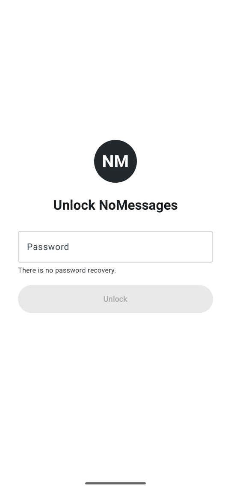
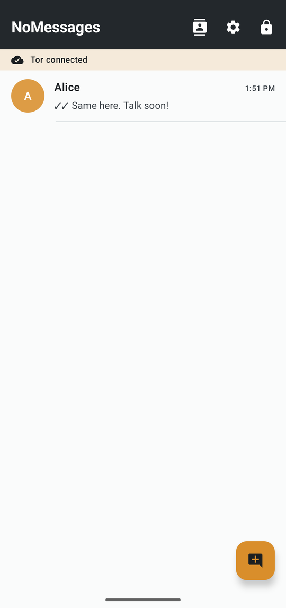
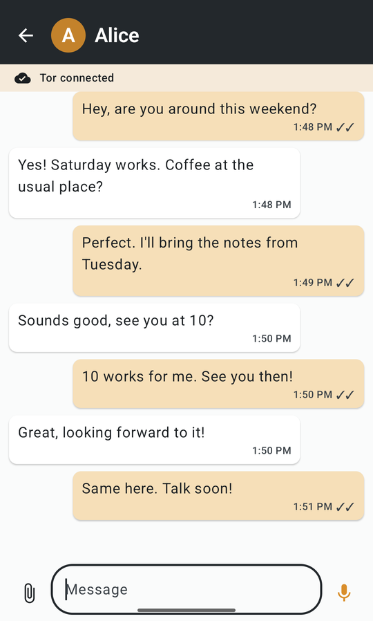
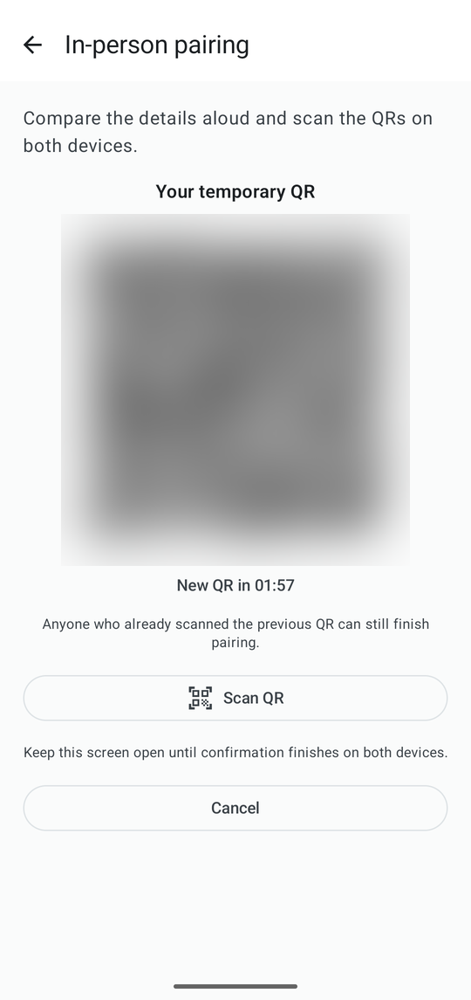
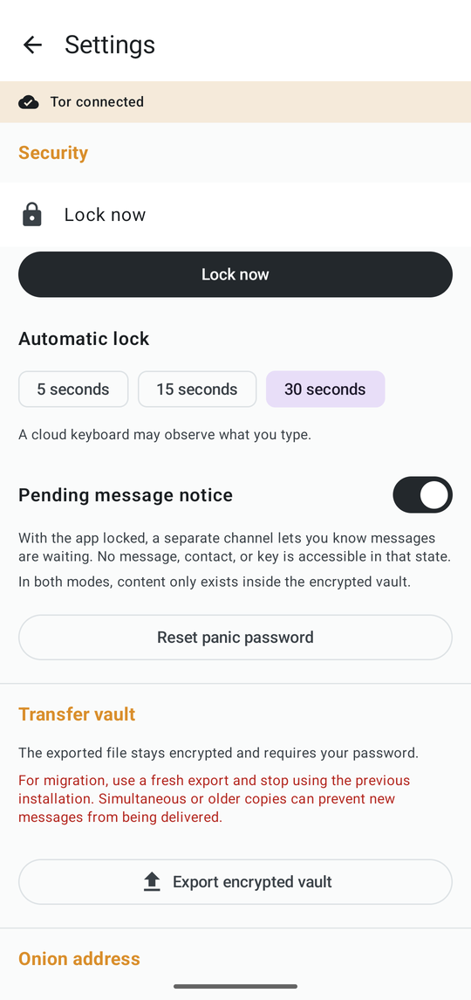
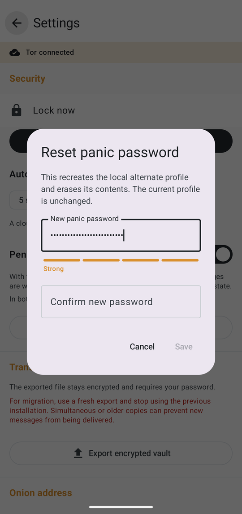
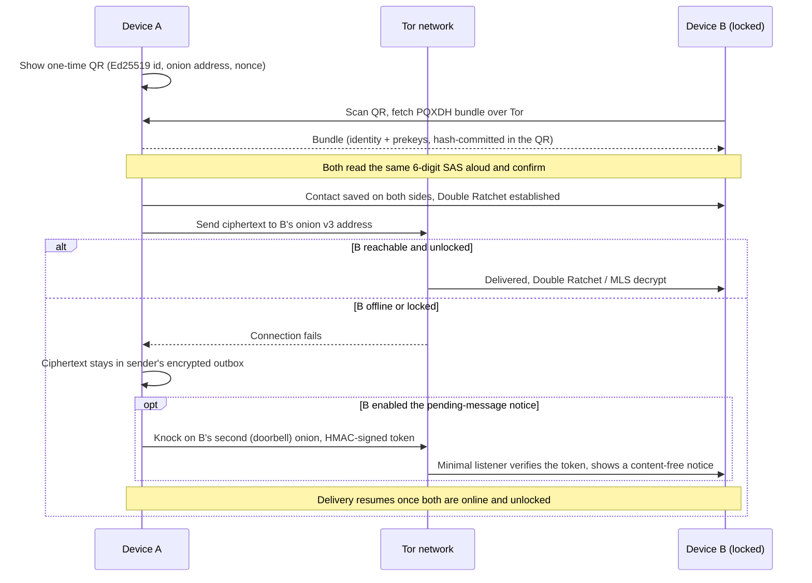

<p align="center">
  
</p>

<h1 align="center">NoMessages</h1>

<p align="center"><strong>An Android messenger with no server-side contact graph: an encrypted vault, in-person QR pairing instead of phone numbers, and Tor onion delivery instead of a company's infrastructure.</strong></p>

<p align="center">
  <a href="LICENSE"></a>
  
  <a href="https://github.com/maxwellmelo/nomessages/actions/workflows/android.yml"></a>
</p>

> **Status.** A signed **v1.0.0** build exists and can be installed (see [Install](#install) below), but the project's own [release checklist](docs/release-checklist.md) still lists all 13 security gates as `NOT_RUN` on physical hardware, and an independent external security audit is still pending. Read [Project status](#project-status) and the [security model](docs/security-model.md) before trusting this app with anything sensitive.

NoMessages is not affiliated with WhatsApp or Meta and includes none of their logos, trademarks or official assets.

## Screenshots

<table>
  <tr>
    <td align="center" width="16.6%"><br><sub>Unlock</sub></td>
    <td align="center" width="16.6%"><br><sub>Chat list</sub></td>
    <td align="center" width="16.6%"><br><sub>Conversation</sub></td>
    <td align="center" width="16.6%"><br><sub>QR pairing</sub></td>
    <td align="center" width="16.6%"><br><sub>Settings</sub></td>
    <td align="center" width="16.6%"><br><sub>Password strength</sub></td>
  </tr>
</table>

*Captured from a debug build with English forced on and the developer-only screenshot escape hatch enabled (see [Known limits](#known-limits-and-deviations)); a release build blocks screenshots entirely, as shown in [Project status](#project-status). Contacts and message text shown are staged sample data, not real conversations. The QR pairing screenshot has its QR code blurred because it encodes a real (test-only) identity and onion address; the conversation screenshot is trimmed to remove an older test thread above the visible messages; every other screenshot is unedited.*

## What it is

Most messengers ask for a phone number, an account, and a server that keeps a copy of who talks to whom. NoMessages removes all three: contacts are exchanged in person by scanning a QR code and reading a six-digit code aloud, messages travel over the Tor network as onion-service traffic instead of through a central server, and everything on the device — messages, files, contacts, keys — lives inside a password-encrypted vault instead of the ordinary app-storage/gallery/backup path.

It is built for people who don't want to trust someone else's answer to "who runs the server" and "what does my phone number reveal" — at the cost of the convenience features (cloud backup, `@username` discovery, a desktop app, delivery while both parties are offline) that come from *having* that central server.

## Features

- **Independent real and decoy vaults.** A mandatory panic password opens a separate, plausible decoy vault instead of the real one; a wrong-password prompt can't tell which wrap it just failed to open. Vaults lock on screen-off or app exit, and can be exported/imported as a single encrypted file to move to a new device.
- **Argon2id + SQLCipher.** Vault passwords are stretched with memory-hard Argon2id (64 MiB floor); the message/contact database is SQLCipher (AES-256); attached files are XChaCha20-Poly1305, chunked and authenticated. Nothing is written to the gallery, and Android's auto-backup is disabled (`allowBackup=false`).
- **QR pairing + 6-digit SAS.** Contacts are added by scanning a single-use QR code and reading a spoken six-digit short authentication string aloud together — no account, no phone number, no global directory, no discovery.
- **libsignal PQXDH + Double Ratchet.** One-to-one conversations use the official libsignal library with a post-quantum-hybrid handshake (X25519 + Kyber-1024) and the Double Ratchet, over each vault's own Tor onion v3 address.
- **OpenMLS groups up to 100 members.** A group can only be created once every pair of members has already paired directly with each other (a 100-person group needs 4,950 signed pairwise edges) — group membership requires a complete pairing graph, not just an inviter's say-so.
- **Inline media, kept inside the vault.** Photos, voice notes and files are viewed in a built-in viewer with decrypted bytes held only in process memory. There is no save-to-gallery and no share-to-another-app affordance for received media — the only way content leaves the vault is an encrypted export that needs the password.
- **Forwarding with a label.** A message can be re-sent into another paired chat and arrives tagged "Forwarded" — informational metadata only, carrying no origin chat, author or count, so forwarding never creates a new metadata trail back to the sender's other conversations.
- **Pending-message notice while locked.** With the app locked, the messaging service and its keys are gone entirely; an optional, per-vault second onion service can still tell you a message is waiting, with no sender, content or count ever exposed in that state ("doorbell", see [How it works](#how-it-works)).
- **Screen-capture resistance.** `FLAG_SECURE` blocks screenshots, screen recording and Recents thumbnails on the lock screen, chats, the attachment viewer and pairing; API 34+ devices also get an on-screen notice if a capture is still attempted.
- **Incognito-mode keyboard hints.** Every text field asks the system IME not to learn from or suggest based on what's typed, disables autofill for the whole UI, and shows a discreet warning when the active keyboard isn't part of the OS image.
- **English and Portuguese**, with the app defaulting to English on any device whose system language is neither (see [Language](#language)).

## How it works



Contacts are proven, not discovered: the only "lookup" in the whole system is fetching a PQXDH key bundle from an onion address the QR already named, and even that fetch is bound to a hash the QR's signature already committed to. There is no mailbox — if the recipient is offline or locked, the message simply waits, encrypted, on the sender's own device.

## Privacy and security model, in short

**What it protects against:**

- A phone number, an account or a server-side contact graph — there is none. Contacts exist only after both devices complete an in-person QR + spoken-SAS ceremony.
- A locked phone in someone else's hands: with the vault locked, the database key and session keys are gone from memory and no plaintext is on disk.
- Passive network observation: transport is Tor onion v3, so there is no IP address of the other party inside the app's ordinary connection path.
- A casual file-size comparison of the two vaults: the real and decoy vaults are kept byte-equal in database and media allocation.
- A forged contact: pairing requires a signed QR exchange and a verbally-confirmed 6-digit code on both devices.

**What it does *not* protect against** (documented in full in [the security model](docs/security-model.md)):

- Root, malware, or a compromised OS — an unlocked app is an ordinary endpoint that can read what it currently holds.
- A malicious or cloud-connected keyboard, which can observe anything typed regardless of the in-app hints described above.
- A device captured or inspected while unlocked with the real password.
- Prolonged coercion: the panic password opens a plausible decoy vault, but this is disk- and UI-level deniability, not a defense against sustained physical coercion.

**No telemetry, no analytics SDKs, no first-party server.** There is no Firebase, no Crashlytics, and no product-usage tracking of any kind — the app has nothing to phone home to. Read [docs/security-model.md](docs/security-model.md) for the complete, evidence-based account of what is and isn't guaranteed, including known deviations from the original spec and what remains unverified on physical hardware.

## Project status

**1.0.0, pre-audit.** A signed release build exists (see [Install](#install)) and passes its own static checks (signature, manifest flags, native library verification) and a basic functional smoke test on an emulator. That is not the same thing as the project's [13 specification gates](docs/release-checklist.md) — locked-vault dumps against wrong keys, real/decoy timing and size parity, screenshot blocking on physical hardware, Tor zero-socket-on-lock, QR replay/expiry, and cryptographic test vectors, among others. **Every one of those gates is currently `NOT_RUN` on physical hardware**, and no independent external security audit has taken place. Some of the underlying work (e.g. keeping the real and decoy vaults size-matched, closing timing side channels in the panic-password flow) has been validated against emulator-based tests but not yet against a seized physical device. See [docs/release-checklist.md](docs/release-checklist.md) for the exact, itemized status of each gate and what evidence would close it.

## Install

Grab the APK from GitHub Releases — this is the only distribution channel; NoMessages is not published on any app store.

1. Download the **v1.0.0** APK from the [GitHub releases page](https://github.com/maxwellmelo/nomessages/releases).
2. Before installing, check the file's **SHA-256** against the value published with the release (also recorded in [`docs/release-checklist.md`](docs/release-checklist.md)):
   ```
   dfadbcb7c500e25cd9e46a5d5c916e5b3534a4cb5edd278687e6a4751343d729
   ```
3. After installing, you can additionally check the signing certificate's fingerprint (`apksigner verify --print-certs`, or any APK inspector):
   ```
   CN=NoMessages, O=NoMessages
   SHA-256: 28:9D:C1:88:5B:BE:A0:96:97:94:74:09:3A:64:F8:53:50:42:27:CC:62:41:A1:B3:84:AC:15:E0:10:39:39:99
   ```
   A file hash or certificate fingerprint that doesn't match either value indicates a tampered APK or one from a different source — do not install it.

**Requirements:** Android 12 (API 31) or later, `arm64-v8a` or `x86_64`.

**Quick start once installed:**

1. On first launch, create a real password and a distinct panic password (12+ characters each, no recovery for the real one).
2. Meet the other person, open **New chat → Show my QR** on one device and **Scan QR** on the other.
3. Read the six-digit code aloud on both devices and confirm it matches on both — the contact is saved only after both sides confirm.
4. Both apps need to be unlocked and connected to Tor to exchange messages; there is no mailbox, so a message queues on the sender's device until the recipient comes online.

## Build from source

Building requires Linux (or WSL2 on Windows), JDK 21, the Android SDK, Rust 1.91+ and the Android NDK — there is no production signing key in the repository, so a locally built APK uses the `dev.mx3.nomessages.debug` package. Full setup, exact commands and Windows/WSL2 instructions are in [CONTRIBUTING.md](CONTRIBUTING.md).

```bash
bash scripts/build-android.sh --bootstrap
```

## Contributing

Contributions are welcome, and every pull request is reviewed and merged solely at the maintainer's discretion (see [CODEOWNERS](.github/CODEOWNERS)). Please read [CONTRIBUTING.md](CONTRIBUTING.md) first — it covers the development setup, coding conventions, and what kind of change needs a maintainer-approved design discussion before code (anything touching cryptography, the wire protocol, the pairing ceremony or the vault format). [CODE_OF_CONDUCT.md](CODE_OF_CONDUCT.md) describes the community expectations for everyone participating.

## Security

Please do not report security vulnerabilities in public issues or pull requests. See [SECURITY.md](SECURITY.md) for private disclosure instructions (GitHub Private Vulnerability Reporting) and the list of currently supported versions.

## Language

The app ships in **English and Portuguese**. English is the default resource set and is what the app shows on any device whose system language is neither English nor Portuguese — Android always falls back to the default resource set for a locale that isn't explicitly listed, never silently to a third language. Portuguese is used only when the device's preferred language is Portuguese (pt-BR or pt-PT). Android 13+ also lets the user pick the app's language independently of the system one, from the app's system settings page.

## Known limits and deviations

- The current libsignal API requires **PQXDH + Double Ratchet**, ahead of the classic X3DH the spec originally anticipated. There is no homegrown substitute for either.
- MLS retains two old epochs for delayed group messages, which has a forward-secrecy cost; a removed member can no longer publish new messages to the group.
- Android/JVM and the native libsignal wrappers offer no proof of immediate erasure of every RAM copy; buffers this codebase controls are wiped, but that is not a universal forensic-erasure claim.
- The Tor (Arti) keystore is ephemeral and guard state is checkpointed in the encrypted database; an abrupt process death can lose recent updates, and public Tor state sits temporarily on disk during a session.
- Two visible database/media files of equal size do not, by themselves, prove plausible deniability; the panic password mitigates limited situations, not sustained coercion.
- Root/malware, a hostile keyboard, an unlocked app in someone else's hands, and RAM captured during active use are all explicitly out of scope of every guarantee above.

Read the [security model](docs/security-model.md) and the [release checklist](docs/release-checklist.md) in full before deciding whether this app is adequate for anything sensitive.

## Project layout

| Directory | Responsibility |
|---|---|
| `core` | Vault, files, pairing, libsignal, the contact graph, wire formats |
| `app` | Compose UI, SQLCipher, lifecycle, camera, audio, files, integration |
| `native` | JNI/libsodium, Arti (Tor), and OpenMLS |
| `scripts` | Build and evidence-collection scripts |
| `docs` | Design decisions, contracts, reviews and validation records |

## License

NoMessages's code is **AGPL-3.0-or-later** — see [LICENSE](LICENSE). The license follows libsignal's own AGPL license, which is a direct dependency of the one-to-one ratchet. Third-party components keep their own licenses and notices; see [THIRD_PARTY_NOTICES.md](THIRD_PARTY_NOTICES.md).

NoMessages is not affiliated with WhatsApp or Meta and includes none of their logos, trademarks or official assets. This README describes what the app does and does not collect; it is not a claim of legal or regulatory compliance for any particular jurisdiction.
